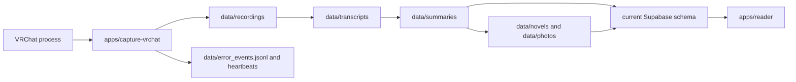

---
codd:
  node_id: "req:architecture"
  type: spec
  status: approved
  links:
    - to: apps/capture-vrchat/src/main.py
      type: implementation
    - to: apps/capture-vrchat/src/app.py
      type: implementation
---

# Current runtime architecture

This document describes the executable, legacy-compatible runtime after its relocation into the Human Memory v2 repository boundaries. It does not describe the target canonical persistence model; see [`architecture/human-memory-v2.md`](architecture/human-memory-v2.md).

## Runtime flow



The current pipeline uses local directories and date-based filenames to identify work. Existing artifacts are reused and missing artifacts are generated. This is preserved behavior during migration, not the v2 state model.

## Deployable boundaries

| Boundary | Responsibility | Status |
|---|---|---|
| `apps/capture-vrchat/` | VRChat detection, audio capture, transcription, generation, synchronization, and operational commands | implemented |
| `apps/reader/` | Next.js reader over the current Supabase projection | implemented |
| `apps/api/` | future HTTP boundary over canonical memory | reserved |
| `apps/mcp/` | future read-first memory tools | reserved |

The Python package remains named `src`. The repository sets `PYTHONPATH` to `apps/capture-vrchat` through `Taskfile.yaml`, CI, systemd rendering, and Windows launch assets.

## Internal dependency direction

The relocated application retains its current domain/use-case/infrastructure organization:

```text
application entry points
        ↓
use cases -> domain protocols <- infrastructure implementations
```

The v2 reusable packages follow the stricter repository rule:

```text
apps -> packages -> protocols <- adapters
```

Packages must not import applications. Domain models must not depend on Supabase, Graphiti, Cognee, Qdrant, model SDKs, Next.js, systemd, or Windows APIs.

## Current processing state

The existing daily pipeline determines work from:

- recording, transcript, summary, novel, image, and evaluation files;
- dates encoded in filenames;
- the presence or absence of corresponding artifacts;
- current synchronization behavior against the existing Supabase schema.

This state mechanism will remain until Phase 3 introduces canonical IDs, ingestion runs, `source_hash + pipeline_version` idempotency, and an outbox. It must not be presented as the final Human Memory v2 design.

## Runtime supervision

### Linux and WSL

`infra/systemd/` contains templates rendered with the active repository root and Python path. Repository validation is performed with:

```bash
task systemd:verify
```

Installation and startup require a working user systemd environment:

```bash
task systemd:install
```

A successful template render or `systemd-analyze --user verify` does not prove that the production user manager, timer, service, audio device, GPU, or credentials are operational.

### Windows

`infra/windows/` contains bootstrap, Task Scheduler, launcher, and watchdog assets. Static repository checks do not prove Task Scheduler registration, WSL startup, audio capture, or watchdog recovery on the actual Windows host.

### Reader

The application root is `apps/reader/`. Local repository validation is:

```bash
task web:build
```

Vercel must be configured with `apps/reader` as its Root Directory before the deployment cutover is considered complete.

## Data and privacy boundary

The current runtime may still read and write machine-local `data/` artifacts and the existing Supabase projection. Human Memory v2 requires:

- raw evidence bytes in private object storage;
- canonical metadata, revisions, ingestion state, outbox events, and publication decisions in PostgreSQL/Supabase;
- reviewed journal and memory views in a private repository;
- public output only after an explicit publication decision.

No current generated summary, novel, image, graph, or vector index is authoritative memory.

## Related documents

- [Documentation index](README.md)
- [Product overview and status](overview.md)
- [Human Memory v2 target architecture](architecture/human-memory-v2.md)
- [Current daily pipeline contract](daily_pipeline_contract.md)
- [Operations](OPERATIONS.md)
