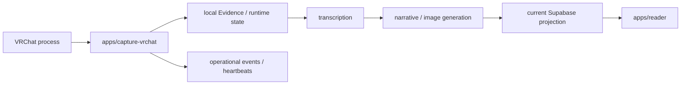

# Current runtime architecture

この文書は現在実行可能なruntimeを記述します。製品不変条件とverification contractは[`SPEC.md`](SPEC.md)、Human Memory v2のtarget persistenceは[`architecture/human-memory-v2.md`](architecture/human-memory-v2.md)を正準とします。

## Runtime flow



現在のpipelineはlocal artifactと既存artifactの有無を利用してpending workを判断します。Human Memory v2のtarget state modelは別途定義されます。machine-local pathの扱いは[`architecture/portability.md`](architecture/portability.md)に従います。

## Deployable boundaries

| Boundary | Responsibility | Repository state |
|---|---|---|
| `apps/capture-vrchat/` | VRChat observation、audio capture、transcription、generation、sync、operations | implemented |
| `apps/reader/` | current Supabase projectionを読むNext.js Reader | implemented |

## Python runtime boundary

capture applicationはuv workspace上のinstallable package `vlog_capture`です。実行はmanifestで定義したconsole entry pointを使います。

```text
vlog             -> vlog_capture.cli:main
vlog-service     -> vlog_capture.main:main
vlog-daily       -> vlog_capture.daily:main
vlog-operations  -> vlog_capture.operations:main
```

Runtime用`PYTHONPATH`や`python -m src...`を前提にしません。package、entry point、Python versionの正準は`pyproject.toml`と`apps/capture-vrchat/pyproject.toml`です。

## Dependency direction

Current application内部は次の責務分離を維持します。

```text
entry points
    ↓
use cases -> domain protocols <- infrastructure implementations
```

Human Memory v2向けreusable packagesでは次を守ります。

```text
apps -> packages -> protocols <- adapters
```

Domain modelはSupabase、Graphiti、Cognee、Qdrant、model SDK、Next.js、systemd、Windows APIへ直接依存させません。

## Current processing state

現在のdaily pipelineは、local recording / transcript / generated artifactと既存Supabase projectionを利用して処理対象を決定します。Human Memory v2のtarget state modelはstable IDs、content hash、explicit ingestion run、`source_hash + pipeline_version` idempotency、transactional outboxです。

## Runtime supervision

### Linux / WSL

`infra/systemd/`にはportable templateとrendererがあります。

```bash
task systemd:verify
task systemd:install
```

Template validationは、実hostのuser systemd、timer、audio、GPU、credentialが動作することを証明しません。

### Windows

`infra/windows/`にはbootstrap、Task Scheduler、launcher、watchdog assetsがあります。repository checkだけでTask Scheduler登録、WSL startup、audio capture、watchdog recoveryをenvironment-verifiedとはしません。

### Reader

Reader rootは`apps/reader/`です。

```bash
task web:build
```

Local build成功とVercel productionのavailability / release provenanceは別のverification layerです。詳細は[`SPEC.md`](SPEC.md)を参照してください。

## Data and privacy boundary

Current runtimeはlocal Evidence / artifact stateとexisting Supabase projectionを使用します。Human Memory v2 targetでは次を分離します。

- raw Evidence bytes: private object storage
- canonical metadata / revisions / ingestion / publication state: PostgreSQL / Supabase
- reviewed human-maintained memory view: private memory repository
- public output: explicit publication decisionを通過したprojection

生成summary、novel、image、graph、vector indexは、それだけではauthoritative memoryではありません。

## Related documents

- [Product specification and guarantees](SPEC.md)
- [Documentation index](README.md)
- [Product overview](overview.md)
- [Human Memory v2 target architecture](architecture/human-memory-v2.md)
- [Cross-platform portability](architecture/portability.md)
- [Operations](OPERATIONS.md)
